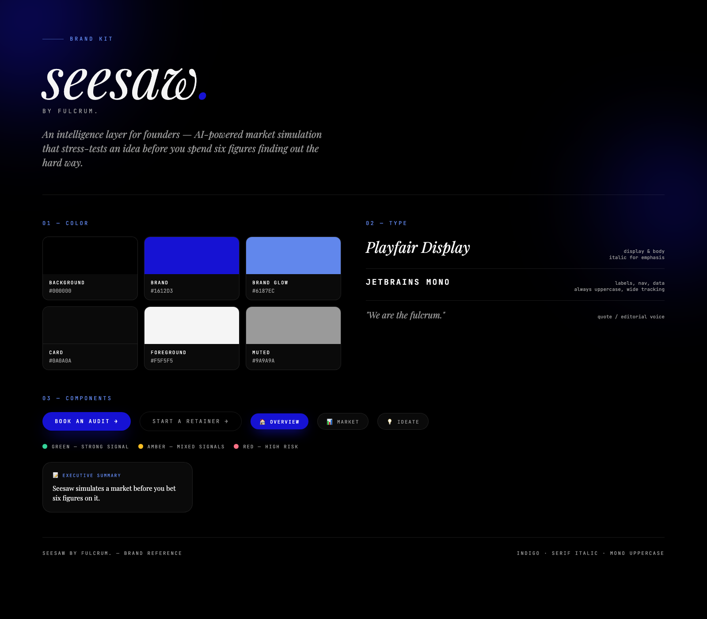

<p align="center">
  
</p>

<p align="center">
  <strong>Market simulation, before you build.</strong>
</p>

---

Seesaw is an intelligence layer for founders. Describe your idea, answer a few
follow-up questions by voice or text, and seesaw stress-tests it — market
size, competitive landscape, product-market-fit signal, unit economics,
feasibility — before you spend six figures finding out the hard way. No fluff,
just a straight verdict backed by real research.

Every report is generated fresh, grounded in live web research and (where
available) precedent from real startup case studies, then handed back as a
structured, explorable dashboard you can revisit, share, or export as a PDF.

## How it works

1. **Pitch it.** Describe your idea through a short form.
2. **Get quizzed.** A voice or text intake asks targeted follow-up questions
   to sharpen the research brief.
3. **Watch it think.** A pipeline of specialized research agents runs
   concurrently against your idea.
4. **Get the verdict.** A synthesis agent weighs every signal into one
   report: TAM/SAM/SOM, competitor breakdown, SWOT, PMF evidence, economics,
   feasibility, and a clear go/no-go read.
5. **Keep it.** Reports are saved to session history and downloadable as PDF.

## Tech

- **Framework** — [Next.js](https://nextjs.org) (App Router) + React 19,
  TypeScript throughout.
- **Styling** — Tailwind CSS v4, a custom serif/mono editorial type system
  (Playfair Display + JetBrains Mono), and an animated brand-gradient shell.
- **Research pipeline** — a set of cooperating Gemini agents
  (`src/lib/gemini/*`), each owning one lens on the idea:
  - `marketSizeAgent` — TAM/SAM/SOM, locale-aware (India/US/Global)
  - `competitorAgent` — competitive landscape
  - `pmfSignalAgent` — product-market-fit evidence
  - `economicsAgent` — unit economics
  - `feasibilityGeoAgent` — feasibility and geographic fit
  - `synthesisAgent` — combines every signal into the final verdict

  Agents use grounded web search via `@google/genai` rather than relying on
  model priors alone.
- **Voice** — speech-to-text via a local Whisper service, text-to-speech via
  Kokoro TTS (replacing browser `speechSynthesis` for consistent, higher
  quality voice intake).
- **Persistence** — SQLite via Prisma ORM (`Session`, `Report`,
  `VoiceExchange`, `IdeateMessage` models), with a `better-sqlite3` adapter.
- **PDF export** — reports render to downloadable PDFs via
  `@react-pdf/renderer`.
- **Testing** — Vitest, with unit coverage on each research agent and the
  pipeline orchestration.

## Getting started

```bash
npm install
npm run dev
```

Open [http://localhost:3000](http://localhost:3000).

```bash
npm run lint   # eslint
npm run test   # vitest
```

Prisma schema lives in `prisma/`; the SQLite dev database is `dev.db`.

## Brand

<p align="center">
  
</p>

Indigo (`#1612D3`) on black, Playfair Display italic for voice, JetBrains Mono
uppercase for structure. Full reference in [`docs/seesaw-brandkit.png`](docs/seesaw-brandkit.png).

---

<p align="center"><sub>© fulcrum. seesaw is fulcrum's market research product.</sub></p>
